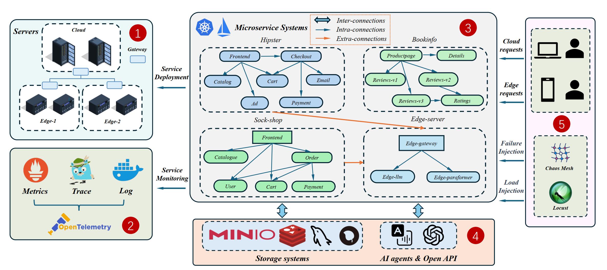

# MicroASBench benchmark

Deployable environments, workloads, and failure injection used to evaluate MicroARCL.
The base environment is documented separately.



## Layout

| Path | Purpose |
| --- | --- |
| `k8s-base-deploy/` | Kubernetes manifests for the base environment |
| `scheduler/` | Base framework for multi-agent services |
| `data-collector/` | Collects metrics, logs, and execution graphs |
| `failure_injection/` | Agent-service deployments and failure-injection entry points |
| `scripts/` | Cluster, monitoring, and service deployment, plus fault injection cases |

## Deployment

Run from this directory:

```bash
make monitor-deploy    # monitoring stack, Chaos Mesh, tcpdump
make service-deploy    # the four conventional microservice systems
```

Both targets call the scripts under `scripts/deploy/`, which apply the manifests in
`k8s-base-deploy/`. See `k8s-base-deploy/README.md` for details.

## Workloads and failures

Agent services are deployed from `failure_injection/`:

```text
MDOC:  failure_injection/failure_injection_MDOC/run_all_services.sh
MAR:   failure_injection/failure_injection_MARBLEbench/run_all_services.sh
Single-service failures:
       failure_injection/failure_injection_{DATASET}/sum_chaos_cloud_{service}.sh
```

These scripts start the agent-service cluster, inject workload with Locust and failures
with Chaos Mesh, and collect metrics, logs, and execution graphs through
`data-collector/`. Collected data is stored in `data/` in the same format as the
published datasets.

## License

This subtree is covered by the [Apache License 2.0](LICENSE). The bundled microservice
systems are third-party projects; credit goes to their original authors.
